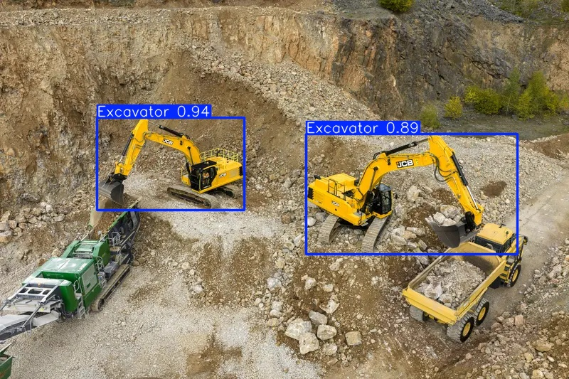
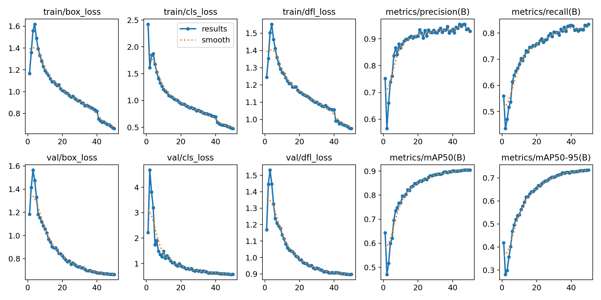
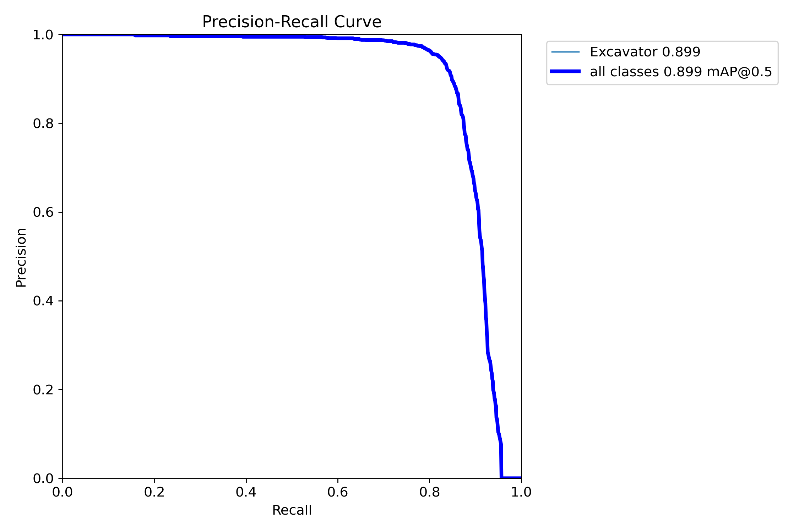
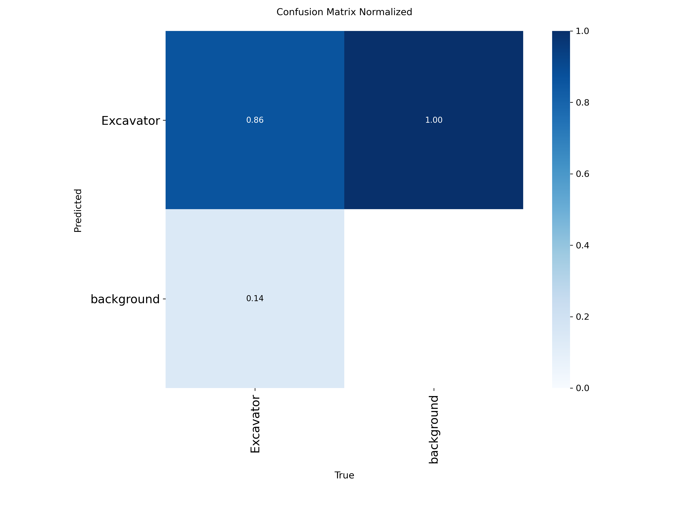

# Excavator Detection with YOLO11

Fine-tune and use a COCO-pretrained YOLO11n model to detect excavators in construction-site images and videos. The project includes dataset inspection, single-class conversion, deterministic splitting, GPU training, held-out test evaluation, image/video/folder inference, and a Streamlit demo.



## Results

YOLO11n was trained for 50 epochs on Kaggle with a Tesla T4 GPU and evaluated once on the held-out test split.

| Model | AP@50 | mAP@50-95 | Precision | Recall |
| --- | ---: | ---: | ---: | ---: |
| YOLO11n | **0.8992** | **0.7323** | **0.9422** | **0.8283** |

The machine-readable metrics are available in [`docs/results/metrics.json`](docs/results/metrics.json). These numbers apply to the deterministic MOCS split described below; they should not be interpreted as performance on every construction environment.

### Download the trained model

- [Download `best.pt`](https://github.com/erfansaffari/excavator-detection/releases/download/v1.0.0/best.pt) — recommended checkpoint for inference
- [Download the complete result bundle](https://github.com/erfansaffari/excavator-detection/releases/download/v1.0.0/excavator_results.zip) — checkpoints, plots, metrics, prediction JSON, environment, and examples
- [View release notes](https://github.com/erfansaffari/excavator-detection/releases/tag/v1.0.0)

`best.pt` is the checkpoint with the best validation fitness. `last.pt` is the final training checkpoint and is mainly useful for resuming a run.

## Quick start

Python 3.10 or newer is recommended.

```bash
git clone https://github.com/erfansaffari/excavator-detection.git
cd excavator-detection
python -m venv .venv
source .venv/bin/activate
python -m pip install -r requirements.txt
```

Download `best.pt` from the release and place it at:

```text
results/train/yolo11n_excavator/weights/best.pt
```

Run detection on an image:

```bash
python scripts/predict.py --source /path/to/test.jpg
```

The annotated result is written to `results/predictions/predict/`.

## Demo

With `best.pt` in the default location, launch the Streamlit app:

```bash
streamlit run app/app.py
```

Upload an image, select a confidence threshold, and view the detected excavators and confidence scores. To keep the checkpoint somewhere else:

```bash
EXCAVATOR_WEIGHTS=/absolute/path/to/best.pt streamlit run app/app.py
```

## Inference

The same script accepts an image, video, image directory, URL, or webcam index. Every saved detection includes its confidence score.

```bash
# Image
python scripts/predict.py --source test.jpg

# Video; detections are processed and rendered frame by frame
python scripts/predict.py --source construction_video.mp4

# Directory of images
python scripts/predict.py --source path/to/images

# Different checkpoint or confidence threshold
python scripts/predict.py \
  --source test.jpg \
  --weights /path/to/best.pt \
  --conf 0.35
```

## Dataset

The project uses the [MOCS construction-site dataset](https://www.kaggle.com/datasets/xiaopan9802/mocs-dataset). The attached Kaggle export was inspected before conversion:

- Format: two COCO JSON annotation files
- Images found: 23,404
- Original classes: 13
- Excavator category: name `Excavator`, original category ID `7`
- Excavator boxes: 12,057
- Original split: train and validation only; no test split

Because the export did not include a test split, all 23,404 images were deterministically redistributed with seed 42. Non-excavator annotations were discarded, the excavator class was remapped to YOLO class `0`, and images without excavators were retained as negative examples.

| Split | Images | Excavator boxes |
| --- | ---: | ---: |
| Train | 16,383 | 8,443 |
| Validation | 3,511 | 1,803 |
| Test | 3,510 | 1,811 |

The complete conversion record is in [`docs/results/dataset_manifest.json`](docs/results/dataset_manifest.json). Review the dataset's current license and terms on Kaggle before reuse. The source dataset is not redistributed in this repository.

## Pipeline

```text
MOCS dataset
    -> inspect COCO annotations and visualize boxes
    -> keep Excavator boxes and remap the class to 0
    -> deterministic 70/15/15 split with seed 42
    -> one-epoch smoke test
    -> fine-tune COCO-pretrained YOLO11n for 50 epochs
    -> evaluate best.pt on the held-out test split
    -> image/video/folder inference and Streamlit demo
```

## Reproduce training

### 1. Download MOCS

Download and extract the dataset into `data/raw/mocs/`, or attach it as a Kaggle Notebook input.

```bash
mkdir -p data/raw/mocs
kaggle datasets download -d xiaopan9802/mocs-dataset -p data/raw/mocs --unzip
```

### 2. Inspect annotations

```bash
python scripts/inspect_dataset.py --data data/raw/mocs --samples 6
```

This reports formats, classes, split information, image/box counts, warnings, and writes labeled samples to `figures/dataset_samples/`.

### 3. Prepare YOLO data

```bash
python scripts/prepare_dataset.py --data data/raw/mocs --seed 42
```

Prepared images and labels are written to `data/processed/{images,labels}/{train,val,test}`. The converter also supports Pascal VOC XML, LabelMe, and existing YOLO exports. It refuses to guess the excavator ID when a class name or verified class map is unavailable.

On Kaggle, use symlinks to avoid copying the full input dataset:

```bash
python scripts/prepare_dataset.py \
  --data /kaggle/input/datasets/xiaopan9802/mocs-dataset \
  --image-mode symlink \
  --seed 42
```

### 4. Smoke test and full training

```bash
# One epoch on a 2% training subset
python scripts/train.py --smoke-test --device 0

# YOLO11n, COCO weights, 640 px, 50 epochs, seed 42, early stopping
python scripts/train.py --device 0
```

Training requires CUDA by default, preventing an accidental multi-hour CPU run. The included [`notebooks/kaggle_training.ipynb`](notebooks/kaggle_training.ipynb) performs the complete inspection, preparation, smoke test, training, evaluation, and export workflow on Kaggle.

### 5. Evaluate the held-out test set

```bash
python scripts/evaluate.py \
  --weights results/train/yolo11n_excavator/weights/best.pt \
  --device 0
```

Evaluation writes `metrics.json`, COCO-style prediction JSON, precision-recall curves, confusion matrices, and labeled/predicted validation batches under `results/evaluation/test/`.

## Training diagnostics

| Training curves | Precision-recall curve |
| --- | --- |
|  |  |



## Tests

Dataset discovery, filtering, coordinate conversion, and deterministic split behavior are covered by automated tests:

```bash
python -m pip install -r requirements-dev.txt
python -m pytest
```

## Repository layout

```text
configs/excavator.yaml       YOLO dataset configuration
docs/                        Published metrics and README figures
excavator_detection/        Dataset discovery and conversion library
scripts/inspect_dataset.py  Format, class, split, and box inspection
scripts/prepare_dataset.py  Excavator filtering and YOLO conversion
scripts/train.py             Smoke test and full training
scripts/evaluate.py          Held-out test metrics and plots
scripts/predict.py           Image, video, and folder inference
app/app.py                   Streamlit image demo
notebooks/kaggle_training.ipynb
tests/                       Dataset conversion and split tests
results/                     Generated local outputs, ignored by Git
```

## Troubleshooting

- **Checkpoint not found:** download `best.pt` and place it at the default path, or pass `--weights /path/to/best.pt`.
- **CUDA unavailable:** enable a Kaggle GPU. For a local functionality check, explicitly use `--device cpu --allow-cpu` when training.
- **Out of memory:** reduce the training batch size to 8 or 4 while keeping `--imgsz 640` for comparable results.
- **No excavator class verified:** inspect the class map and provide a class ID only after verifying it from the dataset metadata.

## References

- [MOCS Kaggle dataset](https://www.kaggle.com/datasets/xiaopan9802/mocs-dataset)
- [MOCS paper](https://doi.org/10.1016/j.autcon.2020.103482)
- [Ultralytics documentation](https://docs.ultralytics.com/)
